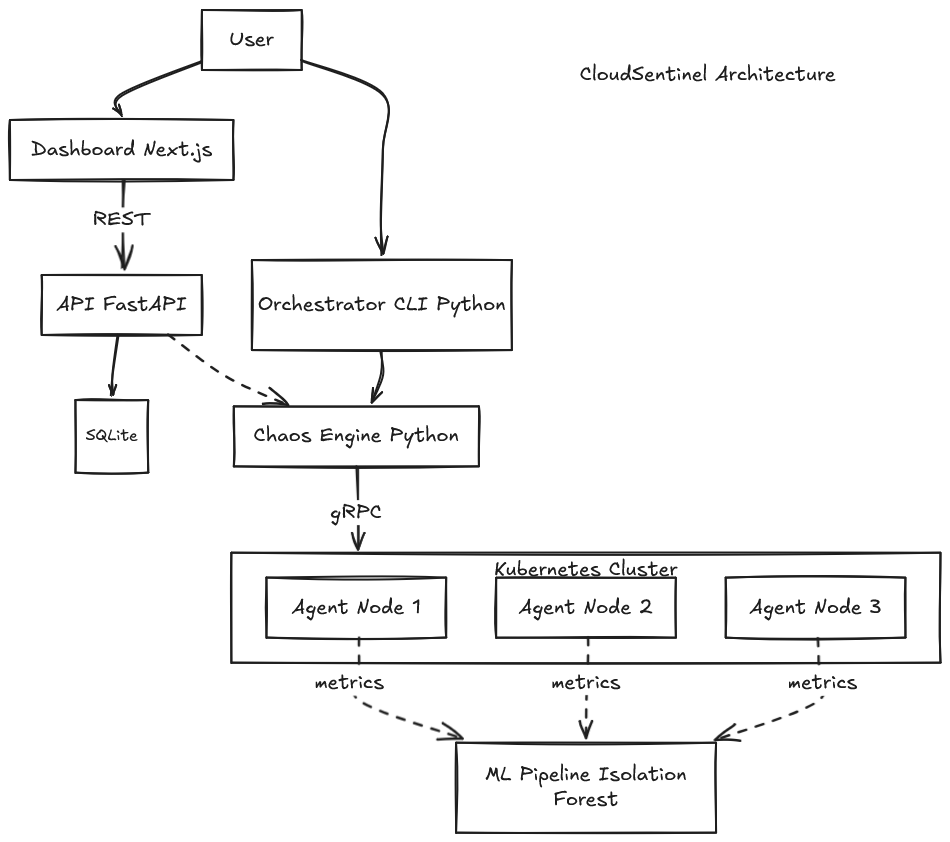

# 🛡️ CloudSentinel

[](https://github.com/mamoudou-cheikh-kane/cloudsentinel/actions/workflows/python-ci.yml)
[](https://github.com/mamoudou-cheikh-kane/cloudsentinel/actions/workflows/go-ci.yml)
[](https://github.com/mamoudou-cheikh-kane/cloudsentinel/actions/workflows/terraform-ci.yml)
[](https://github.com/mamoudou-cheikh-kane/cloudsentinel/releases)
[](LICENSE)

> **Multi-cloud chaos engineering platform for Kubernetes.**
> Provision clusters, inject **real** faults, collect metrics, detect anomalies — all in one typed, tested toolkit.

[](https://www.python.org)
[](https://go.dev)
[](https://www.typescriptlang.org)
[](https://kubernetes.io)
[](https://fastapi.tiangolo.com)
[](https://nextjs.org)

---

## 🎯 What is CloudSentinel?

CloudSentinel is a **production-grade chaos engineering platform** that lets you:

- 🏗️ **Provision** Kubernetes clusters (Kind, EKS, AKS, GKE) through a single Python CLI
- 💥 **Inject real faults** into any node (CPU stress, memory pressure, network latency, disk fill)
- 📊 **Collect** node-level metrics via a lightweight Go agent running as a DaemonSet
- 🎛️ **Drive** scenarios from a REST API, a web dashboard, or the command line
- 🤖 **Detect** anomalies in collected metrics with an Isolation Forest model

> 💡 **v0.2.0 highlight**: All four fault types are now fully implemented and validated end-to-end on a real Kind cluster. See the [v0.2.0 release notes](https://github.com/mamoudou-cheikh-kane/cloudsentinel/releases/tag/v0.2.0) for details.

## 🚀 Try it in one command

```bash
git clone https://github.com/mamoudou-cheikh-kane/cloudsentinel
cd cloudsentinel
make demo
```

That's it. The `make demo` target spins up a local Kind cluster, builds and loads the agent image, deploys the DaemonSet, and exposes the agent's gRPC + Prometheus endpoints on `localhost`. Three minutes from clone to a working chaos engineering setup.

Then, from another terminal, inject a real CPU stress fault:

```bash
grpcurl -plaintext -d '{"type":"FAULT_TYPE_CPU_STRESS","duration_seconds":30,"parameters":{"intensity":"80","workers":"2"}}' \
    localhost:50051 cloudsentinel.agent.v1.AgentService/InjectFault
```

The agent will register the fault, spawn worker goroutines that actually consume CPU cycles for 30 seconds, then auto-cleanup. Watch it live:

```bash
kubectl -n cloudsentinel logs -l app.kubernetes.io/name=cloudsentinel-agent -f
```

## ✅ What's verified

Every fault implementation comes with tests that **prove the behavior** rather than just check return codes:

| Fault | Verified by | Result |
|-------|-------------|--------|
| **CPU Stress** | `syscall.Getrusage` measures consumed CPU-seconds | 1.5 CPU-seconds per 1 wall-second with 2 workers at 80% intensity |
| **Memory Pressure** | `runtime.MemStats` measures heap before/during/after | 100 MB requested → 100 MB allocated → 0 MB after Stop+GC |
| **Disk Fill** | `os.Stat` measures file size on disk | 10 MiB requested → 10485760 bytes exact, fsync verified |
| **Network Latency** | Mock TCExecutor verifies `tc` invocation | Idempotent Stop, no leaked qdiscs on Start failure |

35 unit tests pass in ~2 seconds. End-to-end validated on Kind v0.23.0 + WSL2 Ubuntu 22.04.

## 📦 Components

| Component | Language | Role |
|-----------|----------|------|
| `orchestrator/` | Python + Poetry | CLI that provisions clusters (Terraform) and runs chaos scenarios over gRPC |
| `agent/` | Go 1.24 | DaemonSet pod exposing Prometheus metrics + gRPC fault injection (4 real fault types) |
| `api/` | Python (FastAPI + SQLModel) | REST API persisting scenarios in SQLite, CORS-ready for the dashboard |
| `dashboard/` | TypeScript (Next.js + Tailwind + shadcn/ui) | Web UI to list, create, and run scenarios with 5s polling |
| `ml-pipeline/` | Python (scikit-learn) | Isolation Forest anomaly detection on node metrics (F1 = 0.98) |
| `infrastructure/` | Terraform | Modules for Kind (done), AKS/EKS/GKE (placeholders) |
| `docs/` | Markdown (MkDocs Material) | Architecture, Getting Started, ML Pipeline guides |

## 🏗️ Architecture



Full details in [`docs/architecture.md`](./docs/architecture.md).

The agent uses a **Strategy Pattern**: each fault type implements a common `Fault` interface (`ID`, `Type`, `Start`, `Stop`, `StartedAt`, `Duration`). A thread-safe in-memory `Registry` tracks active faults and schedules automatic Stop after the configured duration via `time.AfterFunc`. The gRPC server is a thin layer that translates protobuf requests into `Fault` objects and delegates execution to the Registry.

The `NetworkLatency` fault uses dependency injection (`TCExecutor` interface) so it stays unit-testable on machines without `tc` or `CAP_NET_ADMIN`.

## 🐳 Production-grade Docker image

The agent ships as a **multi-stage Docker build** with three stages:

1. **builder** (Alpine) compiles a static Go binary with `-trimpath` and `-ldflags="-s -w"`
2. **tc-stage** (Debian bookworm-slim) installs `iproute2` to extract the `tc` binary
3. **runtime** (`gcr.io/distroless/base-debian12:nonroot`) copies just `/agent` and `/usr/sbin/tc` plus 10 runtime libraries

Result: a **56 MB image** that runs as UID/GID 65532, drops every Linux capability except `NET_ADMIN`, has no shell, no package manager, and no init system. The DaemonSet manifest sets `terminationGracePeriodSeconds: 30` so the agent can clean up active faults gracefully on `SIGTERM`, plus an init container that removes orphan `tc` qdiscs at pod startup.

## 🧪 Testing

| Suite | Tests | Runtime |
|-------|-------|---------|
| Go — agent (faults + grpc) | **35** | ~2s |
| Python — orchestrator | 24 | ~1s |
| Python — API (FastAPI + SQLite) | 11 | <1s |
| Python — ML pipeline | 13 | ~2s |
| **Total** | **83** | **~6s** |

Run everything with `make test-all`. Run just the Go suite with `make test-agent`.

## 🧰 Tech Stack

**Languages**: Python 3.11 · Go 1.24 · TypeScript 5 · Protobuf · Terraform 1.5
**Backend**: FastAPI · SQLModel · Pydantic v2 · Poetry 2.x · gRPC
**Frontend**: Next.js 16 · Tailwind CSS v4 · shadcn/ui · Radix · React hooks
**Infrastructure**: Kubernetes · Docker (multi-stage, distroless) · Kind · Prometheus · iproute2/tc
**ML**: scikit-learn (Isolation Forest) · pandas · numpy · joblib
**CI/CD**: GitHub Actions (4 pipelines) · pre-commit · Ruff · gofmt · Conventional Commits
**Docs**: MkDocs Material on GitHub Pages

## 📖 Documentation

Documentation is published at **https://mamoudou-cheikh-kane.github.io/cloudsentinel/**

To build it locally:

```bash
pip install --user mkdocs mkdocs-material
mkdocs serve --dev-addr 127.0.0.1:8001
```

## 🗺️ Roadmap

### ✅ Niveau 1 — Real fault injection (v0.2.0, shipped)
- 4 real fault implementations (CPU, memory, disk, network)
- Strategy Pattern + thread-safe Registry + auto-cleanup
- Robust rollback (signal handler, init container, NET_ADMIN, gracePeriod 30s)
- Production-grade Docker image (56 MB, distroless + tc)
- One-command demo via `make demo`
- 35 unit tests, all green in ~2s

### ⏳ Niveau 2 — Scenarios as Code (next sprint)
- Declarative YAML format for chaos scenarios with hypotheses
- Prometheus-based assertions (steady-state, during, after)
- Soft / hard severity for each assertion
- Markdown + JSON reports

### ⏳ Niveau 3 — LLM-assisted hypothesis generation
- `cloudsentinel suggest --cluster prod` proposes scenarios based on cluster topology
- Auto-remediation experiments

### ⏳ Niveau 4 — Helm Chart + CRD
- Official Helm Chart for production deployment
- Kubernetes CRD `ChaosScenario` for GitOps workflows

### ⏳ Niveau 5 — CNCF Sandbox submission
- Multi-region coordination
- KubeCon talk submission
- /comparison page (vs Chaos Mesh, LitmusChaos, Gremlin)

## 📄 License

Apache License 2.0 — see [LICENSE](./LICENSE)

## 🙋 About

Built by **Mamoudou Cheikh Kane** as a deep-dive into distributed systems testing, Kubernetes
tooling, and end-to-end product engineering.

Contact: mamoudoucheikhk@gmail.com
