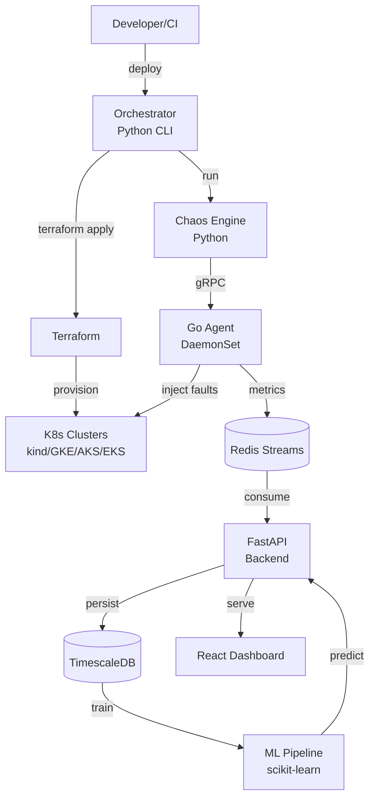

# CloudSentinel — Architecture

## Overview

CloudSentinel is a distributed system testing platform composed of 6 independent but connected services.

## Component Diagram

## Data Flow

1. **Orchestrator** reads YAML config → invokes Terraform → provisions K8s cluster
2. **Agent** is deployed as DaemonSet → exposes Prometheus metrics + gRPC commands
3. **Chaos Engine** reads scenario → sends fault injection commands to agents
4. **Agents** stream metrics to Redis → Python consumer persists to TimescaleDB
5. **Dashboard** queries FastAPI → displays real-time and historical data
6. **ML Pipeline** retrains weekly on new data → predictions served via API

## Design Principles

- **Provider abstraction** — single interface for kind/GKE/AKS/EKS
- **Event-driven telemetry** — Redis Streams decouples agents from backend
- **ML as augmentation** — predictions complement, don't replace, human judgment
- **Fail-safe chaos** — every fault injection has automatic rollback
- **Observable by default** — Prometheus metrics everywhere

## Technology Decisions

Detailed ADRs (Architecture Decision Records) will be added to `docs/adr/` as decisions are made during implementation. See template in `docs/adr/000-template.md` (coming soon).
